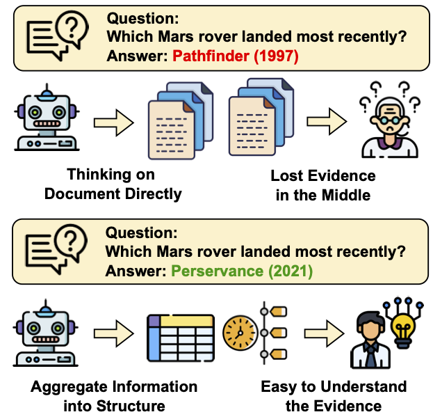
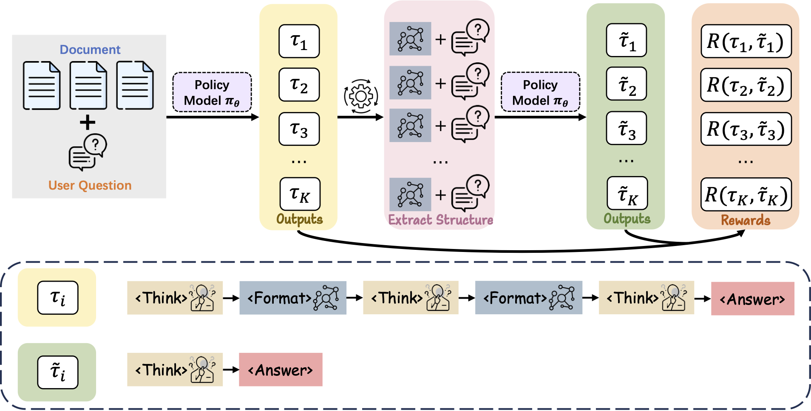

# Structure-R1: Dynamically Leveraging Structural Knowledge in LLM Reasoning through Reinforcement Learning

[](https://arxiv.org/abs/2510.15191)
[](./LICENSE)


Official repository for **Structure-R1**, a framework that enables large language models (LLMs) to **dynamically generate and leverage structured knowledge** to enhance complex reasoning through **reinforcement learning**.

---

## 📖 Overview

<p align="center">
  
  
</p>

Large Language Models often underuse retrieved information when it is left in an **unstructured** form.  
**Structure-R1** enables an LLM to actively transform retrievals into compact, query-specific **structured representations**, including **Chunks**, **Knowledge Graphs**, **Tables**, **Catalogues**, **Algorithms**, and prompt-induced **custom, self-developed formats**, and to learn this behavior via **reinforcement learning**.

Concretely, Structure-R1:

- **Generates task-specific structures** from retrieved evidence: Chunk, Knowledge Graph, Table, Catalogue, Algorithm, or a custom format.
- **Learns a policy over structure actions** (select, compose, refine) to build the most useful representation for each query.
- **Modified GRPO training** coupled with **self-reward structural verification** to optimize both structure utility and final answers.
- **Closes the loop** between structure construction and answer generation so that better structures yield better reasoning.

This reduces redundancy, increases information density, and improves reasoning accuracy across diverse knowledge-intensive tasks.

---

## 📦 Installation

```bash
conda create -n trl_sr1_env python=3.10
conda activate trl_sr1_env

pip install -e .[dev]
pip install vllm
pip install deepspeed
```

---

## 🚀 How to Run

### 0) Download Dataset

First, download the [dataset](https://huggingface.co/datasets/jlwu002/sr1_dataset) to the `data_process` folder.

### 1) Data process

```bash
# Train split
python data_process/multihop_train_dataset_trl.py

# Test split (process all data)
python data_process/multihop_test_dataset_trl.py --all_data
```

### 2) SR1 training

```bash
# Warmup
accelerate launch \
  --config_file accelerate_configs/deepspeed_zero2.yaml \
  scripts/train_grpo_qwen_7b_sr1_warmup.py

# Main training
accelerate launch \
  --config_file accelerate_configs/deepspeed_zero2.yaml \
  scripts/train_grpo_qwen_7b_sr1.py
```

### 3) Inference

```bash
python scripts/inference_sr1.py \
  --model_path results/grpo_qwen_7b_sr1 \
  --data_path data_process/multihop_test_dataset \
  --output_path output_results.txt \
  --file_name detailed_output.jsonl
```

Notes:
- The `--config_file` path above uses this repo's `accelerate_configs/deepspeed_zero2.yaml`.
- Adjust `--model_path`, `--data_path`, and output args to your environment.

---

## 📄 Paper

> **Structure-R1: Dynamically Leveraging Structural Knowledge in LLM Reasoning through Reinforcement Learning**  
> Junlin Wu, Xianrui Zhong, Jiashuo Sun, Bolian Li, Bowen Jin, Jiawei Han, Qingkai Zeng  
> *arXiv: 2510.15191*  
> [[📄 Read on arXiv]](https://arxiv.org/abs/2510.15191)
